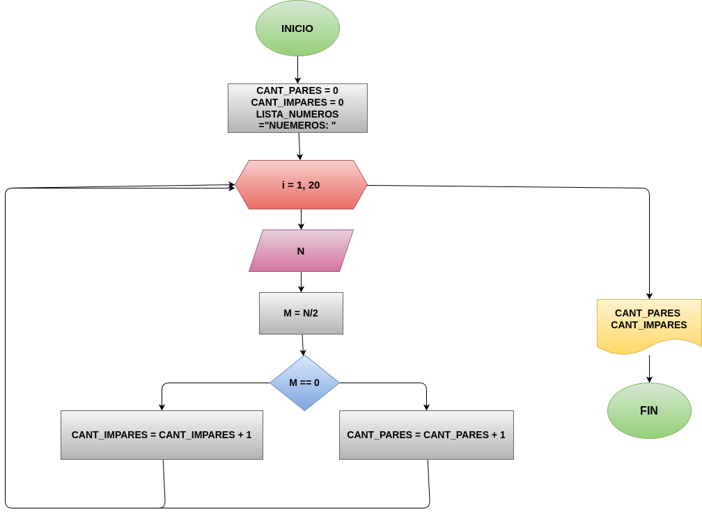

# Ejercicio 1: par_o_impar
Programa en Phyton para saber si un número es par o impar 

## Análisis

### Variable de entrada 
- CANT_PARES 
- CANT_IMPARES 
- LISTA_NUMEROS 

### Procesamiento
for i in range (1, 6):

    n=int(input("Digite el numero " + str(i)+":"))

    LISTA_NUMEROS = LISTA_NUMEROS + str(n) +" "

    m = n%2

    if(m==0):

        CANT_PARES = CANT_PARES+1
    
    else:

        CANT_IMPARES = CANT_IMPARES+1

### Variabe de salida
- cuantos numeros son pares 
- cuantos numeros son impares 
- lista de numeros de los que se coloco

## Diseño

## Consturcción 

- codigo implementado en el archivo "par_o_impar" 