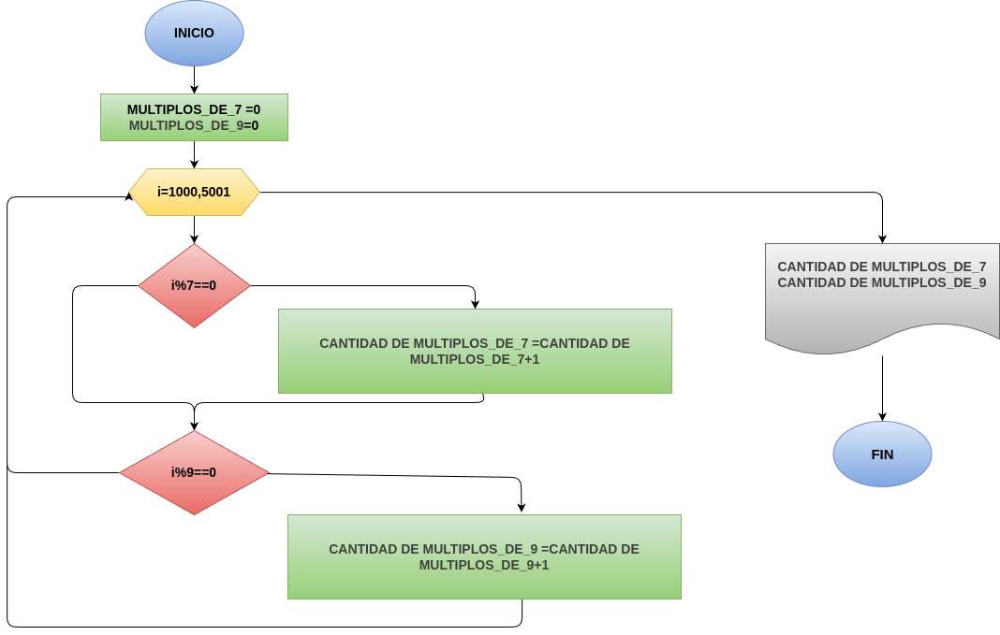

# Ejercicio 2: multiplos_7_Y_9
Programa en Phyton para saber la cantidad de multiplos que hay del 7 y el 9 entre el 1000 y el 5000

## Análisis

### Variable de entrada 
- multiplos_de_7
- multiplos_de_9

### Procesamiento
for i in range(1000, 5001):

    if i % 7 == 0:

        multiplos_de_7 += 1

    else:

        pass

    if i % 9 == 0:

        multiplos_de_9 += 1

    else:

        pass
### Variabe de salida
- La cantidad de múltiplos de 7
- La cantidad de múltiplos de 9

## Diseño

## Consturcción 

- codigo implementado en el archivo "multiplos_7_Y_9"